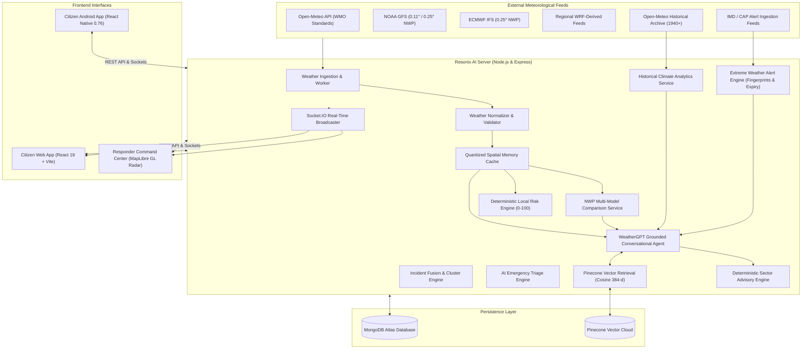
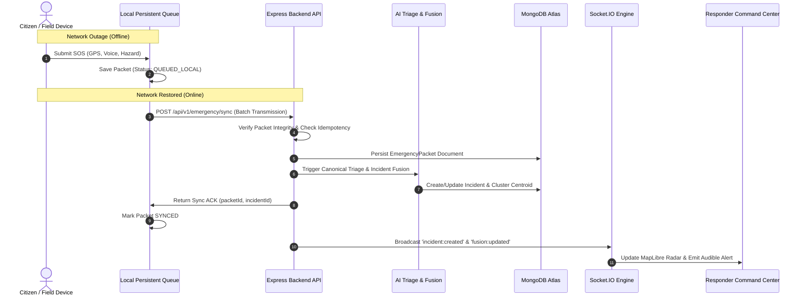

# Resonix AI
### Offline-First Weather Intelligence & Disaster Response Platform
#### Problem Statement 26068

[](https://nodejs.org/)
[](https://expressjs.com/)
[](https://react.dev/)
[](https://reactnative.dev/)
[](https://vitejs.dev/)
[](https://www.mongodb.com/)
[](https://socket.io/)
[](https://www.pinecone.io/)
[](https://tailwindcss.com/)
[](https://maplibre.org/)
[](https://opensource.org/licenses/ISC)

---

## 1. Project Overview

**Resonix AI** is an offline-first weather intelligence and emergency response platform built for **Problem Statement 26068**. The system unifies real-time meteorological intelligence, conversational reasoning, official government weather alerts, numerical weather prediction (NWP) model comparisons, historical climate analysis, sector-specific advisories, and offline-first citizen emergency reporting into a single operational platform.

At its core, Resonix AI is driven by a foundational principle:

$$\text{Forecast} + \text{Official Warning} + \text{Local Risk} + \text{Ground Truth} \implies \text{Actionable Weather Intelligence}$$

Conventional meteorological portals focus primarily on describing atmospheric conditions that may occur across large regional grids. However, during severe convective storms, flash floods, or localized emergencies, high-level regional forecasts often fail to reflect actual on-the-ground impacts—such as waterlogged underpasses, downed powerlines, or trapped citizens. 

Resonix AI bridges this divide. It provides live meteorological context and conversational AI access to citizens, while continuously ingesting, clustering, and visualizing empirical citizen-reported ground conditions directly on responder tactical radars.

---

## 2. Core Problem

Resonix AI addresses several systemic bottlenecks in conventional meteorological warning and emergency management systems:

1. **Fragmented Meteorological Data**: Weather observations, numerical models (GFS, ECMWF), radar products, and official alert bulletins are scattered across incompatible formats, isolated portals, and dense meteorological code tables.
2. **Technical Complexity & Cognitive Load**: Raw values such as convective available potential energy (CAPE), hectopascals (hPa), and millimeter rainfall rates are difficult for ordinary citizens and field workers to translate into actionable decisions.
3. **Lack of Conversational & Multilingual Access**: Citizens cannot query weather systems using everyday conversational phrasing in their native languages (e.g., asking in Tamil or Hindi whether it is safe to spray crops tomorrow).
4. **Voice Accessibility Deficits**: Hands-free, low-literacy, and rural users are frequently excluded from text-only or complex UI dashboards.
5. **Disconnected Warning Feeds**: Official warnings are rarely linked directly with hyper-local live weather observations or multi-model forecasts.
6. **Sector Advisory Gap**: Farmers, small-craft mariners, and light aviators need specific operational thresholds rather than generic city-wide temperatures.
7. **Absence of Ground Truth Verification**: Meteorological stations and satellite passes can miss hyper-local cloudbursts or localized drainage failures that citizens observe first-hand.
8. **Communication Blackouts**: During severe cyclones or floods, cell towers lose power and internet connectivity drops. Most modern emergency web apps fail completely in offline conditions.
9. **Responder Information Overload**: Command centers receive hundreds of duplicate SOS calls and reports, causing triage delays and resource misallocation.
10. **Hallucination Risks in LLMs**: Off-the-shelf generative AI models regularly hallucinate temperatures, rainfall amounts, and emergency advice when asked weather questions without factual data grounding.

---

## 3. Solution

Resonix AI resolves these challenges through a unified multi-stage intelligence and response pipeline:

```text
Meteorological Data (Open-Meteo, WMO Codes, Satellite/Station Observations)
        ↓
Weather Intelligence & Normalization (Sanity Checks, Caching, Attribution)
        ↓
Forecast + Multi-Model NWP (NOAA GFS, ECMWF IFS, Regional WRF-Derived) + Warnings (IMD/CAP)
        ↓
Deterministic Local Risk Assessment (0–100 Weighted Multi-Factor Score)
        ↓
WeatherGPT (Intent Recognition, Spatial-Temporal Resolution, Grounded AI)
        ↓
Localized Sector Advisories (Farmer, Aviation, Marine) & Citizen Access
        ↓
Citizen Ground Reports (GPS Geolocation, Multimodal Audio, Category)
        ↓
Offline Emergency Reporting (Persistent Queue, Store-and-Forward Sync, P2P/BLE Relay)
        ↓
Responder Intelligence (Automated AI Triage, Clustering, Probable Area Estimation)
        ↓
Response Coordination (MapLibre Tactical Radar, Resource Dispatch, Socket.IO Sync)
```

Each stage operates deterministically with strict data provenance. Real physical measurements are separated from model predictions, official statutory warnings, and analytical decision-support indices.

---

## 4. Key Differentiator: Forecast + Ground Truth

The fundamental differentiator of Resonix AI is the synthesis of predictive atmospheric modeling with empirical citizen ground truth:

```text
       FORECAST                    OFFICIAL WARNINGS
(NWP Models: GFS, ECMWF,        (Authoritative IMD / CAP
     WRF-Derived)                Government Bulletins)
             \                          /
              \                        /
               ▼                      ▼
           +------------------------------+
           |       RESONIX AI UNIFIED     |
           |      SITUATION ASSESSMENT    |
           +------------------------------+
               ▲                      ▲
              /                        \
             /                          \
   DETERMINISTIC RISK SIGNALS     CITIZEN GROUND TRUTH
  (Accumulation, Wind Gusts,      (Empirical SOS Reports,
     Historical Anomalies)         Fused Incident Clusters)
```

* **Forecast Systems** estimate future atmospheric probabilities.
* **Official Warnings** dictate statutory emergency declarations.
* **Deterministic Risk Signals** evaluate real-time physical thresholds and multi-year anomalies.
* **Citizen Ground Reports** capture real-world consequences as they occur in specific streets and sectors.

> [!IMPORTANT]
> **Boundary Principle**: Citizen reports provide operational situational awareness; they do **NOT** replace, override, or alter official government meteorological warnings.

---

## 5. Major Features

### Weather Intelligence
* **Current Observations**: Temperature, apparent (feels-like) temperature, relative humidity, surface air pressure, precipitation rate, WMO weather codes, wind speed, wind direction, and peak wind gusts.
* **Hourly Forecast**: 24-hour chronological forecast covering hourly precipitation probabilities, cloud cover, and convective wind trends.
* **Daily Forecast**: 7-day weather trajectory with daily maximum/minimum temperatures, daily precipitation sums, and dominant conditions.
* **Dual Location Modes**: 
  * *Current Device GPS*: Real-time browser Geolocation API with accuracy tolerances.
  * *Searchable Alternate Locations*: Geocoding search autocomplete and reverse-geocoding for any global or Indian coordinate.
* **Caching & Freshness Architecture**: In-memory quantized coordinate caching with configurable TTLs (15-minute observation cache, 1-hour forecast cache), cache headers, stale-data fallbacks, and explicit source timestamps.

### WeatherGPT: Grounded Conversational Weather Agent
* **Natural-Language Understanding**: Interprets free-form weather inquiries (e.g., *"Will it pour heavily in Madurai this evening?"*).
* **Intent & Entity Extraction**: Identifies query type (`CURRENT`, `FORECAST`, `RAIN_CHECK`, `TEMPERATURE`, `WIND`, `WARNINGS`, `CLIMATE_HISTORY`, `SECTOR_ADVISORY`), extracts location entities, and determines target temporal windows (`TODAY`, `TOMORROW`, `WEEKEND`, specific date).
* **Automated Tool Invocation**: Retrieves verified meteorological metrics from backend services prior to generating any textual response.
* **Strict Anti-Hallucination Boundaries**: The model is forbidden from inventing temperatures, rain probabilities, or warnings. If a metric is missing from the retrieved payload, the system explicitly reports that the data is unavailable.
* **Stratified Evidence Layers**: Every WeatherGPT response maintains internal data layers:
  1. `[OBSERVED DATA]`
  2. `[FORECAST]`
  3. `[WARNING]`
  4. `[AI INTERPRETATION]`
  5. `[CITIZEN REPORT]`

### Extreme Weather Alert Engine
* **CAP / Warning Feed Ingestion**: Ingests structured warning feeds with alert IDs, event types, severity levels (`RED`, `ORANGE`, `YELLOW`, `GREEN`), effective timestamps, and expiry timestamps.
* **Geospatial Relevance Matching**: Compares alert bounding coordinates against citizen location or responder tactical theater.
* **Duplicate Alert Suppression**: Uses cryptographic fingerprint hashing of warning contents to prevent duplicate notifications.
* **Automated Expiry Sweeper**: Background 60-second sweeper automatically evicts expired warnings from the active radar and archives them to history.
* **Real-Time Push Broadcast**: Dispatches active alerts through Socket.IO rooms, in-app banners, and browser notification channels.

### Numerical Weather Prediction (NWP) Multi-Model Pipeline
* **NOAA GFS (Global Forecast System)**:
  * Operating Agency: NOAA / NCEP
  * Dynamical Core: Finite-Volume Cubed-Sphere (FV3)
  * Resolution: 0.11° (~13 km) / 0.25° (~28 km) global grid
  * Run Cycles: 00z, 06z, 12z, 18z UTC; forecast horizon up to 384 hours.
* **ECMWF IFS (Integrated Forecasting System)**:
  * Operating Agency: European Centre for Medium-Range Weather Forecasts
  * Dynamical Core: Spectral transform semi-Lagrangian (IFS)
  * Resolution: 0.25° (~25 km)
  * Run Cycles: 00z, 12z UTC; forecast horizon up to 240 hours.
* **Regional Mesoscale Numerical Prediction (WRF Architecture)**:
  * Ingests regional mesoscale WRF-derived datasets (3 km to 9 km regional grid) derived via high-resolution provider streams with Thompson microphysics and Noah-MP land-surface parametrization.
  * *Note: Resonix AI ingests and harmonizes WRF-derived output via upstream numerical providers; it does not execute the raw Fortran WRF binaries on-server.*
* **Multi-Model Consensus & Spread**: Computes ensemble mean temperature, mean precipitation, and standard deviation (spread) across models to quantify forecast uncertainty.

### Historical Weather & Climate Analytics
* **Open-Meteo Historical Archive Ingestion**: Queries authentic recorded weather observations spanning from 1940 to the present.
* **Monthly Meteorological Profiles**: 12-month breakdowns of historical rainfall sums, average temperatures, and extreme heat days.
* **Multi-Year Climate Trend Analysis**: Compares current seasonal precipitation against 5-year and 10-year historical baselines to identify climate anomalies and drought/excess patterns.

### Local Weather Risk Engine (Decision Support Layer)
* **Deterministic Scoring (0–100)**: Transparent weighted score synthesizing:
  * Rainfall intensity and 24-hour accumulation (mm).
  * Precipitation probability (%).
  * Sustained wind speed and peak gusts (km/h).
  * Active official warnings (IMD/CAP).
  * Forecast convective weather codes.
  * Historical anomaly deviations.
  * Active nearby citizen flood/storm ground reports.
* **Standardized Risk Tiers**:
  * `LOW` (0–24)
  * `MODERATE` (25–49)
  * `HIGH` (50–74)
  * `CRITICAL` (75–100)
* **Explicit Independence**: Formally separated from statutory government warnings.

### Sector Advisory Engine
Resonix AI provides deterministic weather advisories tailored to three distinct operational sectors, powered by the same verified meteorological retrieval pipeline:

```text
                  WeatherGPT Query + Sector Slot
                                │
          ┌─────────────────────┼─────────────────────┐
          ▼                     ▼                     ▼
     [ FARMER ]            [ AVIATION ]           [ MARINE ]
• Rain probability      • Sustained wind &    • Wind speed & gusts
• Wind for spraying       gust thresholds     • Convective storms
• Temperature extremes  • Cloud base/vis      • Coastal warnings
• Soil moisture context • Thunderstorm alert  • Explicit notice on
                        • Mandatory general     unavailable wave/
                          awareness disclaimer    swell data
```

1. **Farmer Advisory**: Evaluates precipitation probability, wind thresholds for spraying, temperature extremes affecting crop pollination, and heavy rain warnings during harvest.
2. **Aviation Advisory**: Evaluates crosswind components, peak gusts, convective storm codes, and visibility thresholds (< 5,000 meters). Strictly includes the fixed disclaimer:
   > *"This is general weather awareness, not an official flight or marine safety clearance. Follow your organization's official protocols."*
3. **Marine Advisory**: Evaluates coastal wind speeds, squall risks, and marine thunderstorm codes. Explicitly handles unavailable wave/swell data by reporting data unavailability rather than fabricating buoy readings.

### Multilingual Intelligence
* **Full Conversational Understanding (10 Languages)**:
  * English (`en`)
  * Tamil (`ta` — Native script & Tanglish transliteration)
  * Hindi (`hi` — Devanagari script & Hinglish)
  * Telugu (`te`)
  * Kannada (`kn`)
  * Malayalam (`ml`)
  * Bengali (`bn`)
  * Marathi (`mr`)
  * Gujarati (`gu`)
  * Punjabi (`pa`)
* **Unified Pipeline**: Utilizes Unicode block inspection and lexical disambiguation to detect language and respond in the user's native script without external translation proxies.
* **UI Language Selector**: Dedicated 7-language immediate frontend selector in Citizen Web (English, Tamil, Hindi, Telugu, Kannada, Malayalam, Bengali).

### Voice & Speech Processing
* **Server-Side Indian ASR**: Sarvam AI Saaras (v3/v4) for regional Indian accents and code-mixed speech.
* **Secondary Transcription**: Google AI speech services for secondary multilingual audio transcription.
* **Client Browser Fallback**: Web Speech API (`webkitSpeechRecognition` / `SpeechSynthesis`) for zero-dependency client-side voice input and playback.
* **Audio Preprocessing**: In-memory inspection of audio buffers, sample rates, MIME types (`audio/webm`, `audio/wav`), and silent chunk suppression.

### Offline-First Emergency Reporting & Store-and-Forward
* **Client Local Queue**: Emergency packets are constructed, cryptographically tagged, and persisted in local storage (`localStorage` in web, `AsyncStorage` / SQLite in mobile) before any network transmission is attempted.
* **Store-and-Forward Daemon**: Continuously checks browser/device connectivity. Upon reconnection, queued packets are automatically dispatched.
* **Server-Side Idempotency**: The backend matches incoming `packetId` and `clientRequestId` attributes against existing database records, guaranteeing zero duplicate incidents and zero lost reports.
* **Distinction of Modes**:
  * *Offline Weather*: Displays cached, last-known meteorological snapshots with explicit staleness badges.
  * *Offline Emergency*: Allows full capture of SOS telemetry (GPS, hazard notes, voice recording, photo reference) for deferred synchronization.

### P2P & Nearby Communication
* **Google Nearby Connections / BLE Transport**: Native Capacitor wrapper integration (`@capacitor-community/bluetooth-le`, `NearbyConnections`) designed for device-to-device local discovery and packet handoff during complete infrastructure blackouts.
* **Store-and-Forward Relay**: Relay nodes store packets received from nearby disconnected peers and upload them to the command center once a relay device re-enters cellular range.
* *Note on Scope: Operates as an opportunistic hop-by-hop relay rather than an unconstrained multi-kilometer mesh network.*

### Responder Command Center
* **MapLibre GL Interactive Radar**: High-performance vector map rendering real incidents and clusters with zero mock data.
* **Multi-Citizen Incident Clustering**: Automatically fuses individual reports within spatial proximity (~0.012° lat/lng) into structured incident clusters.
* **Centroid & Spread Estimation**: Calculates cluster centroid coordinates, maximum spatial spread in meters, and Estimated Reporting Area (km²) using deterministic Haversine calculations.
* **Incident Lifecycle State Machine**: Responders transition incidents across `active` ➔ `acknowledged` ➔ `resolved`, instantly synchronized across all connected screens via Socket.IO.
* **Resource Fleet Management**: Live tracking and allocation of operational units (`AMBULANCE`, `FIRE_TRUCK`, `RESCUE_BOAT`, `NDRF_TEAM`).

### Citizen SOS Telemetry
* **One-Touch Hazard Dispatch**: Instant reporting for `FLOOD`, `FIRE`, `CYCLONE`, `LANDSLIDE`, `ROAD_BLOCKAGE`, `MEDICAL_EMERGENCY`, `INFRASTRUCTURE_DAMAGE`, or `OTHER`.
* **Multimodal Attachments**: Captures voice notes, camera photos, and manual descriptions.
* **Configurable Countdown**: Safety timer setting allowing cancellation before automated dispatch.
* **Real-Time Acknowledgment**: Emits visual and audible alerts when a command center responder acknowledges the citizen's distress call.

---

## 6. AI & Models Used

| Model / AI Technology | Used For | Why It Is Used |
| :--- | :--- | :--- |
| **Gemini 3.8 Flash** | Primary Emergency Reasoning, Intent Recognition, Grounded WeatherGPT Synthesis | High-throughput multimodal reasoning, low latency, and robust structured JSON compliance for situational analysis. |
| **Gemini 3.5 Transcribe** | Authoritative Recorded SOS Audio Speech-to-Text | Deep multilingual comprehension across Indian accents, background disaster noise resilience, and native script transcription. |
| **Gemini 3.5 Transcribe Live** | Optional Real-Time Streaming Transcription | Low-latency streaming speech recognition for live conversational sessions. |
| **Gemini 3.1 Flash Live** | Optional Bidirectional Voice Dialogue | Real-time interactive voice assistance for accessibility and citizen voice guidance. |
| **Gemini 3.1 Flash TTS** | High-Fidelity Spoken Audio Guidance | Produces clear spoken voice audio for hands-free and low-literacy advisory delivery. |
| **Gemini 3.5 Live Translate** | Real-Time Speech Translation | Instant spoken translation between Indian regional languages and English command center channels. |
| **Gemma 4 31B / 26B (`gemma-4-31b-it`)** | Secondary Verification & Deterministic Fast-Path Adjudication | Provides independent secondary verification, ensuring high-confidence disaster classification and privacy-preserving local analysis. |
| **Sarvam AI Saaras (v3/v4)** | Indian-Language ASR & Translation | State-of-the-art speech recognition specifically optimized for Indian languages, regional dialects, and code-mixed speech (Tanglish, Hinglish). |
| **Pinecone Vector Database** | 384-Dimensional RAG Semantic Search | Low-latency vector indexing of official NDMA, NDRF, and WHO disaster protocols using cosine similarity (relevance threshold $\ge 0.35$). |
| **Web Speech API** | Client-Side Speech Fallback | Zero-latency, browser-native speech recognition and synthesis operating without external API keys or cloud dependencies. |

---

## 7. AI Safety & Anti-Hallucination Architecture

Resonix AI implements a strict evidence-first grounding architecture that prevents the LLM from fabricating meteorological observations:

```text
User Question: "Is it going to rain heavily in Chennai tomorrow?"
                     │
                     ▼
             1. Intent Detection
         (Identifies: RAIN_CHECK, 
     Location: Chennai, Time: TOMORROW)
                     │
                     ▼
        2. Geospatial & Temporal Tools
    (Resolves: lat 13.08, lon 80.27; Date: +24h)
                     │
                     ▼
       3. Real Meteorological Retrieval
    (Fetches: precipitationProbabilityMax: 85%,
    precipitationSum: 42mm, windSpeed: 28 km/h,
            activeAlert: "ORANGE")
                     │
                     ▼
          4. Evidence Stratification
    [OBSERVED]: Current temp 31°C, Humidity 78%
    [FORECAST]: 85% rain probability, 42mm sum
    [WARNING]: IMD Orange Alert for heavy rain
    [CITIZEN]: 2 active waterlogging reports
                     │
                     ▼
        5. Constrained AI Reasoning
   (System prompt strictly forbids inventing any
   metrics; model synthesizes only provided facts)
                     │
                     ▼
        6. Grounded Response Delivered
```

### Hallucination Protection Invariants
* **Zero Temperature Fabrication**: The LLM is prohibited from guessing current or future temperatures.
* **Zero Warning Fabrication**: The LLM cannot declare official weather warnings; it may only explain warnings retrieved from the verified alert engine.
* **Explicit Missing Data Handling**: If a parameter (such as marine wave height or visibility) is unavailable from the sensor/model feed, the system outputs: *"Data is currently unavailable"* rather than estimating.
* **Deterministic Fallback**: If the cloud LLM is unreachable, the system automatically uses pre-compiled deterministic templates that present the raw numbers cleanly without generative AI.

---

## 8. Sector Advisory Safety & Disclaimers

Advisories for agriculture, aviation, and marine operations are governed by deterministic rule tables evaluated against real weather data:

* **Farmer Rules**:
  * If precipitation probability $\ge 60\%$ or active rain $\ge 5\text{ mm}$: Advises against pesticide/fertilizer spraying to avoid chemical runoff.
  * If wind speed $\ge 25\text{ km/h}$: Advises postponing aerial or high-pressure crop spraying due to wind drift.
* **Aviation Rules**:
  * Evaluates wind speeds $\ge 30\text{ km/h}$, gusts $\ge 45\text{ km/h}$, visibility $< 5,000\text{ m}$, and thunderstorm codes.
  * **Strict Constraint**: Never issues flight clearances, takeoff approvals, or "go/no-go" commands.
  * **Mandatory Disclaimer**: Appends the fixed general awareness disclaimer in the user's language.
* **Marine Rules**:
  * Evaluates sustained gale winds $\ge 40\text{ km/h}$, gust speeds $\ge 55\text{ km/h}$, and convective storm codes.
  * **Strict Constraint**: Never certifies sea-worthiness or vessel clearances.

```text
Fixed Advisory Disclaimer:
"This is general weather awareness, not an official flight or marine safety clearance. Follow your organization's official protocols."
```

---

## 9. Marine Data Limitation

Resonix AI maintains strict data honesty regarding marine oceanography:
* Standard land and coastal meteorological feeds provide wind speed, wind gusts, atmospheric pressure, and convective storm indicators.
* Specialized oceanographic metrics—specifically **significant wave height**, **swell period**, and **sea surface current vectors**—require specialized offshore marine buoy feeds and oceanographic hydrodynamic models.
* When specialized buoy feeds are absent, Resonix AI **explicitly states that wave and swell data is unavailable**, rather than fabricating ocean states from wind speeds.

---

## 10. Advisory Authority Limitation

Resonix AI is an analytical decision-support and situational awareness platform. It does **NOT** act as a statutory authority:
* **Statutory Weather Authority**: India Meteorological Department (IMD) remains the sole authoritative agency for national weather warnings.
* **Aviation Authority**: Directorate General of Civil Aviation (DGCA) and Airport Authority of India (AAI) protocols supersede all Resonix aviation advisories.
* **Maritime Authority**: Indian Coast Guard and National Hydrographic Office bulletins remain authoritative for maritime operations.
* **Disaster Management**: National Disaster Management Authority (NDMA) and State Disaster Management Authorities (SDMA) govern mandatory evacuations.

---

## 11. Technical Architecture





---

## 12. Complete Tech Stack

### Frontend (Citizen Web)
* **React 19.2.7**: Modern declarative component architecture utilizing Concurrent features.
* **Vite 8.1.1**: Ultra-fast ESM-based bundling and hot module replacement.
* **Tailwind CSS 4.3.3**: Modern utility-first styling for responsive mobile-first layouts.
* **Lucide React 1.27.0**: Crisp, accessible system iconography.
* **Socket.IO Client 4.8.3**: Resilient WebSocket client with automatic fallback to HTTP polling.
* **Capacitor Core 8.5.0**: Native runtime bridge for Bluetooth LE and device hardware access.

### Mobile Client (Citizen Android)
* **React Native 0.76.9**: Native Android mobile emergency application (`com.resonixai.citizen`).
* **AsyncStorage 2.1.0**: Persistent on-device key-value document store for the offline store-and-forward queue.
* **Socket.IO Client 4.8.3**: Real-time duplex socket transport.
* **Android Studio & Gradle**: Native build pipeline targeting Android SDK 34+.

### Responder Command Center
* **React 19.0.0 & Vite 6.1.0**: High-performance single-page operational application.
* **MapLibre GL 5.1.0**: Open-source, hardware-accelerated vector mapping engine rendering incident geometries and clusters with zero third-party map token constraints.
* **Tailwind CSS 4.0.0 & clsx / tailwind-merge**: Resilient styling utilities for dark-mode tactical radar interfaces.

### Backend & API Server
* **Node.js (>= 18.0.0)**: Asynchronous event-driven JavaScript server runtime.
* **Express.js 4.19.2**: RESTful routing, parameter validation, and middleware composition.
* **Socket.IO 4.8.3**: Distributed WebSocket engine managing room-based broadcasting (`responders`, `user:${id}`).
* **Mongoose 8.3.1**: Schema-based ODM for MongoDB with indexing and geospatial validation.
* **Winston 3.13.0 & Morgan 1.10.0**: Structured JSON logging and HTTP request telemetry.
* **Multer 1.4.5-lts.1**: In-memory multipart/form-data audio and image payload ingestion.

### AI & Speech Processing
* **Google AI Studio Client (`@google/genai` architecture via REST)**: Interfacing with Gemini 3.8 Flash, Gemini 3.5 Transcribe, and Gemma 4.
* **Sarvam AI REST API**: Specialized Indian-language speech-to-text and translation adapter.
* **Pinecone Vector Client**: REST-based 384-dimensional dense semantic vector similarity retrieval.

### Security & Infrastructure
* **Helmet 7.1.0**: HTTP security header hardening.
* **Express Rate Limit 7.2.0**: IP-based rate limiting protecting AI reasoning, voice endpoints, and auth routes.
* **JSON Web Token (JWT) 9.0.2**: Stateless bearer authentication for responders and commanders.
* **Bcryptjs 2.4.3**: Salted password hashing (10 rounds).
* **Render**: Cloud PaaS deployment with dynamic port binding (`0.0.0.0:$PORT`).

---

## 13. Database Architecture

The persistence layer is managed through **MongoDB Atlas** using **Mongoose** schemas:

```text
Application Services ➔ REST Controllers ➔ Mongoose Models ➔ MongoDB Atlas
```

### Core Collections & Models

1. **`EmergencyPacket`**: Stores immutable telemetry packets originating from citizen devices.
   * `packetId` (Unique String, Indexed), `clientRequestId`, `userId`, `deviceId`, `timestamp`.
   * `category` (`FIRE`, `FLOOD`, `MEDICAL`, `CYCLONE`, `LANDSLIDE`, `OTHER`).
   * `gpsCoordinates` (`latitude`, `longitude`, `accuracyMeters`).
   * `voiceTranscript`, `photoEvidence`, `integrityHash`, `status` (`RECEIVED`, `TRIAGED`, `DISPATCHED`).
   * `deliveryStatus` (`DIRECT_CELLULAR`, `OFFLINE_SYNC`, `MESH_RELAY`).

2. **`Incident`**: Operational disaster incidents managed by the command center.
   * `title`, `description`, `category` (Normalized 8 canonical categories).
   * `severity` (`LOW`, `MEDIUM`, `HIGH`, `CRITICAL`), `priorityScore` (0–100).
   * `location` (`name`, GeoJSON Coordinates `[longitude, latitude]`).
   * `status` (`active`, `acknowledged`, `resolved`), `assignedResponders` (Array).
   * `aiAssessment` (Extracted entities, people trapped, hazard risks).

3. **`User`**: Account records for citizens, field responders, and commanders.
   * `name`, `email`, `password` (Bcrypt hash), `role` (`citizen`, `responder`, `admin`, `commander`).
   * `badgeId`, `agency`, `preferredLanguage`, `isApproved`, `isActive`.

4. **`WeatherAlert`**: Cached official extreme weather warnings.
   * `alertId`, `fingerprint` (Crypto hash for deduplication), `event`, `severity`, `effectiveTime`, `expiryTime`, `affectedArea`.

5. **`WeatherSnapshot`**: Periodic cached meteorological snapshots mapped to quantized coordinate grids.

6. **`Resource`**: Operational emergency fleet tracking.
   * `resourceId`, `name`, `type` (`AMBULANCE`, `FIRE_TRUCK`, `RESCUE_BOAT`, `PERSONNEL`), `status` (`AVAILABLE`, `ALLOCATED`, `EN_ROUTE`, `ON_SCENE`), `assignedIncidentId`.

7. **`RelayNode`**: P2P and Bluetooth relay node status records.

8. **AI Audit Trail Models**: `AiAnalysis`, `AiDecisionRecord`, `ConfidenceScoreRecord`, `ExplainableAiRecord` maintaining full auditability of automated triage recommendations.

---

## 14. API Architecture

All endpoints are versioned and mounted under `/api/v1/*`:

### Meteorological & Forecast Endpoints
* `GET /api/v1/weather/current`: Real-time weather observations for `lat` and `lon`.
* `GET /api/v1/weather/forecast/hourly`: 24-hour chronological forecast.
* `GET /api/v1/weather/forecast/daily`: 7-day weather trajectory.
* `GET /api/v1/weather/comprehensive`: Full bundle (current, hourly, daily, warnings, attribution).
* `GET /api/v1/weather/lookup`: Search locations by query string.
* `GET /api/v1/weather/reverse-lookup`: Reverse geocode coordinates to locality name.
* `POST /api/v1/weather/ask`: Conversational WeatherGPT natural-language query handler.
* `POST /api/v1/weather/voice/query`: Multilingual voice query pipeline (STT $\to$ WeatherGPT $\to$ TTS).

### NWP & Climate Endpoints
* `GET /api/v1/weather/nwp/forecast`: Single NWP model forecast (`?model=gfs|ecmwf|wrf`).
* `GET /api/v1/weather/nwp/compare`: Multi-model side-by-side comparison with consensus and spread.
* `GET /api/v1/weather/nwp/models`: Documented metadata for all registered NWP models.
* `GET /api/v1/weather/historical`: Recorded historical measurements back to 1940.
* `GET /api/v1/weather/historical/monthly`: 12-month temperature and rainfall profile.
* `GET /api/v1/weather/climate-trends`: 5-year and 10-year climate trend analysis.

### Local Risk & Unified Situation Endpoints
* `GET /api/v1/weather/risk`: Local weather risk evaluation (0–100 score and tier).
* `GET /api/v1/weather/situation`: Resonix Unified Situation View synthesizing forecast and ground truth.
* `GET /api/v1/weather/alerts/active`: Active official warnings affecting coordinates.
* `GET /api/v1/weather/alerts/latest`: Latest active warning for location.

### Emergency & Incident Endpoints
* `POST /api/v1/emergency/create`: Submit a structured emergency packet.
* `POST /api/v1/emergency/sync`: Batch sync queued offline emergency packets.
* `POST /api/v1/emergency/transcribe`: Multilingual recorded audio transcription.
* `GET /api/v1/incidents`: Query active disaster incidents with category and severity filters.
* `GET /api/v1/incidents/fusion`: Query fused multi-citizen incident clusters with centroids and spread.
* `PUT /api/v1/incidents/:id/acknowledge`: Responder operational acknowledgment.
* `PUT /api/v1/incidents/:id`: Update incident status (`active` $\to$ `resolved`).

### Authentication & Account Endpoints
* `POST /api/v1/auth/register`: Citizen or responder registration.
* `POST /api/v1/auth/login`: Authenticate and issue JWT bearer token.
* `GET /api/v1/auth/me`: Validate current session and retrieve profile.

---

## 15. Real-Time Architecture (Socket.IO)

Resonix AI uses a real-time event pipeline for instantaneous situational coordination:

```text
Citizen Action / Backend Event
            │
            ▼
    SocketService Server
            │
    ┌───────┴────────────────────────┐
    ▼                                ▼
Room: 'responders'           Room: 'user:${id}'
    │                                │
    ▼                                ▼
Responder Command Radar      Citizen Mobile/Web App
(New Incident Sound,         (SOS Status Change,
Live Marker Projection)      Responder Acknowledged)
```

### Registered Real-Time Socket Events
* `incident:created`: Emitted when an emergency report is submitted or synchronized; triggers radar marker projection and alert sounds.
* `incident:updated`: Emitted when an incident is acknowledged, reassigned, or marked resolved.
* `fusion:updated`: Broadcasts recalculated cluster centroids, incident groupings, and estimated reporting areas.
* `resource:updated`: Emits resource state changes (`AVAILABLE` $\to$ `ALLOCATED` $\to$ `ON_SCENE`).
* `weather:updated`: Broadcasts refreshed meteorological conditions.
* `weather:alert`: Pushes newly ingested official extreme weather alerts.
* `voice:live_transcribe`: Decoupled streaming socket channel for real-time speech transcription.

### Duplicate Prevention & Memory Management
The socket engine maintains a sliding window cache of processed event IDs (`processedEventIds` with a 500-event ceiling), preventing duplicate broadcasts caused by socket reconnections.

---

## 16. Offline Architecture

```text
                     +---------------------------------------+
                     |         DEVICE CONNECTIVITY           |
                     +-------------------+-------------------+
                                         |
                    ┌────────────────────┴────────────────────┐
                    ▼                                         ▼
            [ ONLINE STATE ]                          [ OFFLINE STATE ]
      • Live meteorological feeds              • Cached meteorological snapshots
      • Conversational WeatherGPT                (explicit staleness indicator)
      • Direct Socket.IO updates               • Interactive offline SOS form
      • Real-time map layers                   • Emergency Packet Builder
                                               • Persistent Local Queue
                                                 (AsyncStorage / localStorage)
                                               • Optional P2P / BLE Relay Handoff
                                                              │
                                                              ▼
                                                   [ CONNECTION RESTORED ]
                                               • Automatic connectivity detection
                                               • Batch synchronization trigger
                                               • Server idempotency check
                                               • Queue clearance & ACK
```

1. **Weather Offline vs. Emergency Offline**:
   * Weather observations require external atmospheric sensors. In offline mode, the app serves **cached last-known snapshots with explicit "Cached Data" tags**. It never fabricates live weather without connectivity.
   * Emergency reporting is fully functional offline. The citizen can record an SOS, attach voice or photos, and capture GPS coordinates.
2. **Cryptographic Integrity & Idempotency**:
   * Every packet receives a deterministic integrity tag (`computePacketIntegrityHash`) combining `packetId`, timestamp, user, and hazard category.
   * If poor network conditions cause a citizen device to retry three times, the server deduplicates by `packetId`, committing the payload exactly once.

---

## 17. Weather Data Pipeline

```text
Geographic Coordinates (lat, lon)
        ↓
Spatial Quantization (0.01° grid snap, ~1.1 km)
        ↓
In-Memory Fast Cache Check (15-min TTL)
        ↓ (Cache Miss)
Fetch Upstream Open-Meteo REST Endpoint (Timeout: 8,000ms)
        ↓
Validation & Sanity Verification (Temp between -50°C and 60°C, Humidity 0–100%)
        ↓
Weather Normalization (Standardize metric units, WMO condition translation)
        ↓
Attach Provider Attribution & Source Timestamps
        ↓
Populate Memory Cache & Serve Client Response
```

* **Graceful Degradation**: If an upstream provider times out or returns HTTP 5xx, the system checks for a stale cached entry, serving it with a warning header rather than failing the request.

---

## 18. NWP Pipeline

The Numerical Weather Prediction pipeline interfaces with multiple authoritative model families through upstream numerical adapters:

1. **Model Registration**: GFS, ECMWF, and regional WRF-derived adapters implement the standardized `NwpProvider` interface.
2. **Parallel Dispatch**: When comparing models, `NwpMultiModelService` issues concurrent queries to all registered adapters.
3. **Consensus & Variance Calculation**:
   * Aligns forecast timestamps across models.
   * Computes the ensemble arithmetic mean for temperature and precipitation.
   * Computes sample standard deviation ($\sigma$) across models. A high spread flags high atmospheric uncertainty to responders and sector operators.

---

## 19. WeatherGPT Pipeline

```text
User Natural-Language Query
        ↓
Language & Script Detection (Tamil, Hindi, Telugu, English, etc.)
        ↓
Intent & Entity Classification (Target metric, location, time window)
        ↓
Location Resolution (Entity mapping, GPS fallback, Geocoding lookup)
        ↓
Tool Execution (Fetches real weather, forecast, alerts, and ground incidents)
        ↓
Factual Payload Assembly (Stratified evidence layers)
        ↓
LLM Prompt Construction (Strict anti-hallucination system prompt)
        ↓
Gemini 3.8 Flash Synthesis
        ↓
Grounded Output Delivered (Optional TTS voice synthesis)
```

---

## 20. Deterministic Risk Engine

The Local Weather Risk Engine computes an objective decision-support score ($S \in [0, 100]$):

$$S = w_{\text{rain}} \cdot S_{\text{rain}} + w_{\text{wind}} \cdot S_{\text{wind}} + w_{\text{alert}} \cdot S_{\text{alert}} + w_{\text{nwp}} \cdot S_{\text{nwp}} + w_{\text{hist}} \cdot S_{\text{hist}} + w_{\text{ground}} \cdot S_{\text{ground}}$$

* **Rainfall Factors**: Current intensity, peak hourly rate (mm/h), and 24h accumulation.
* **Wind Factors**: Sustained wind speed and peak gust velocity.
* **Official Warnings**: Severity weighting for active IMD/CAP bulletins (Red Alert adds substantial weight).
* **Ground Reports**: Number and proximity of active flood, waterlogging, or collapse incidents reported by citizens within a 25 km radius.
* **Result**: Categorized into `LOW`, `MODERATE`, `HIGH`, or `CRITICAL` with human-readable contributing reasons.

---

## 21. Incident Triage & Clustering Engine

Citizen reports are structured into 8 canonical disaster types:
1. **Flood** (Waterlogging, submergence, rising water)
2. **Fire** (Structural fire, forest fire, gas leak)
3. **Cyclone** (Gale damage, roof detachment, storm surge)
4. **Landslide** (Slope failure, mudslide, rockfall)
5. **Road Blockage** (Fallen trees, debris, flooded highways)
6. **Medical Emergency** (Injuries, critical illness, trapped patients)
7. **Infrastructure Damage** (Bridge collapse, power grid failure)
8. **Other** (General hazard reports)

### Spatial Clustering Algorithm
* Reports occurring within ~0.012° latitude/longitude (~1.3 km) of each other with matching or correlated hazard profiles are grouped into a cluster.
* **Centroid Calculation**: Calculates geographic midpoint of all reports in the cluster.
* **Estimated Reporting Area**: Computes the bounding area (km²) and spatial spread (meters) using Haversine formulas.
* **Zero Overwrite**: The original citizen text and voice transcripts are permanently preserved as source evidence.

---

## 22. User Interfaces

### 1. Citizen Web Application (`client-citizen`)
* **Live Weather Dashboard**: Temperature, wind, humidity, pressure, and hourly/daily forecast cards.
* **WeatherGPT Assistant**: Conversational chat interface supporting English, Tamil, Hindi, and 7 other Indian languages with voice input and audio playback.
* **Sector Advisory Panel**: Dropdown toggles for Farmer, Aviation, and Marine operational guidance.
* **Climate & NWP Drawers**: Visual historical rainfall profiles and GFS/ECMWF model comparison graphs.
* **Emergency SOS Module**: Fast-path emergency dispatch with hazard category buttons, voice recording, photo attachment, and countdown safety timer.

### 2. Citizen Mobile Application (`client-citizen-mobile`)
* **React Native Android Client**: Standalone APK targeting Android devices.
* **Offline Store-and-Forward**: Automatic local persistence of distress packets when out of coverage.
* **Hardware GPS Access**: Direct native location provider integration.

### 3. Responder Command Center (`client-responder`)
* **MapLibre GL Tactical Radar**: Real-time vector map projecting individual incidents, cluster boundaries, and responder assets.
* **Priority Actions Deck**: Triage inbox sorting incidents by severity, victim count, and life-safety keywords (e.g., trapped, rising water).
* **Unified Situation View**: Side-by-side display of meteorological forecasts, official warnings, local risk scores, and ground truth reports.
* **Fleet Management**: Real-time dispatching and status management for ambulances, fire engines, boats, and NDRF rescue teams.

---

## 23. User Flows

### Flow 1: Weather Intelligence & Advisory
```text
Citizen Opens App ➔ GPS Detected ➔ Live Weather Rendered
   ➔ User Asks: "Can I harvest paddy tomorrow in Thanjavur?"
   ➔ WeatherGPT Extracts Intent + Location
   ➔ Backend Fetches Forecast + Warnings for Thanjavur
   ➔ Deterministic Sector Engine Evaluates Rain Probability
   ➔ Grounded Response Displayed in Tamil / English
```

### Flow 2: Emergency SOS During Cellular Failure
```text
Citizen in Disaster Area (Cell Tower Inactive) ➔ Presses "FLOOD SOS"
   ➔ App Captures GPS + Audio Note ➔ Network Request Times Out
   ➔ Packet Saved to Local Storage (Status: QUEUED_LOCAL)
   ➔ Citizen Moves to Safe Zone / Cell Signal Restored
   ➔ Network Monitor Fires Reconnect Event
   ➔ Queue Engine Sends POST /api/v1/emergency/sync
   ➔ Server Persists Incident ➔ Socket.IO Broadcasts to Command Center
   ➔ Responder Map Projects Red Flood Marker
```

---

## 24. Setup & Installation

### Prerequisites
* **Node.js**: Version 18.x or higher
* **npm**: Version 9.x or higher
* **MongoDB**: Local MongoDB instance or MongoDB Atlas connection URI
* **Android Studio & Android SDK**: Required only for compiling `client-citizen-mobile`

### Repository Setup
```bash
git clone https://github.com/VishalRoshanP/Resonix-AI.git
cd "Resonix AI"
```

### 1. Backend Server Setup
```bash
cd server
npm install
npm run dev
```

### 2. Citizen Web Client Setup
```bash
cd ../client-citizen
npm install
npm run dev
```

### 3. Responder Command Center Setup
```bash
cd ../client-responder
npm install
npm run dev
```

### 4. Citizen Mobile App Setup (Android)
```bash
cd ../client-citizen-mobile
npm install
npx react-native run-android
```

---

## 25. Environment Variables

All sensitive credentials reside strictly in server-side `.env` files. **Never commit `.env` files or expose secrets in frontend bundles.**

### Server Environment Variables (`server/.env`)

| Variable | Purpose | Where Used |
| :--- | :--- | :--- |
| `PORT` | Local server port (Default: `5000`) | Server HTTP listener (`server.js`) |
| `MONGODB_URI` | MongoDB Atlas cluster connection URI | Mongoose database connection (`config/db.js`) |
| `JWT_SECRET` | Cryptographic secret for signing auth tokens | Auth token manager & middleware |
| `NODE_ENV` | Application environment (`development` / `production`) | Server logging and CORS policy |
| `GEMINI_API_KEY` | Google AI Studio API key | Server AI reasoning, transcription, and TTS |
| `GOOGLE_AI_BASE_URL` | Base URL for Google AI Studio API | AI client (`services/gemma/googleAiClient.js`) |
| `GEMINI_REASONING_MODEL` | Model for WeatherGPT & incident triage (`gemini-3.8-flash`) | AI capability router |
| `GEMINI_TRANSCRIBE_MODEL` | Model for recorded SOS transcription (`gemini-3.5-transcribe`) | Speech-to-text service |
| `GEMMA_MODEL` | Secondary verification model (`gemma-4-26b-a4b-it`) | Secondary verification pipeline |
| `SARVAM_API_KEY` | Sarvam AI API key for Indian speech processing | Sarvam client (`services/speech/sarvamClient.js`) |
| `PINECONE_API_KEY` | Pinecone API key for RAG vector index | Pinecone vector service |
| `PINECONE_INDEX_NAME` | Pinecone index name (`resonix-disaster-kb`) | Knowledge base vector search |
| `ADMIN_EMAIL` | Default administrator account for bootstrap | Admin seeding (`scripts/bootstrapAdmin.js`) |
| `ADMIN_PASSWORD` | Default administrator password for bootstrap | Admin seeding (`scripts/bootstrapAdmin.js`) |
| `ADMIN_BADGE_ID` | Default administrator badge identifier | Admin seeding (`scripts/bootstrapAdmin.js`) |

### Client Web Environment Variables (`client-citizen/.env`, `client-responder/.env`)

| Variable | Purpose | Where Used |
| :--- | :--- | :--- |
| `VITE_BACKEND_URL` | Base URL for backend Express API (e.g. `http://localhost:5000`) | API client & Socket.IO connection |
| `VITE_APP_MODE` | Application mode (`citizen` or `responder`) | Client layout routing |
| `VITE_ENABLE_MOCK_FALLBACK` | Enforces real data mode when set to `false` | API error handling |

---

## 26. API Key Security & Production Boundaries

```text
+-------------------------------------------------------+
|  CLIENT BROWSERS & ANDROID APKs (UNTRUSTED ZONE)      |
|  - Zero API keys embedded                             |
|  - Only connects to your own backend /api/v1/*        |
+---------------------------+---------------------------+
                            |
                     HTTPS Requests
                            |
                            v
+-------------------------------------------------------+
|  EXPRESS BACKEND SERVER (SECURE TRUSTED ZONE)         |
|  - GEMINI_API_KEY stored in process.env               |
|  - SARVAM_API_KEY stored in process.env               |
|  - PINECONE_API_KEY stored in process.env             |
|  - MONGODB_URI stored in process.env                  |
+---------------------------+---------------------------+
                            |
       Encrypted Outbound API Calls to Providers
                            |
                            v
      Google AI Studio / Sarvam / Pinecone / Open-Meteo
```

* **No Leaked Secrets**: All external AI, vector, and database keys remain on the Node.js server.
* **CORS Protection**: Access to backend endpoints is restricted to configured domain origins.
* **Rate Limiting**: Protects expensive endpoints against quota exhaustion or denial-of-service attempts.

---

## 27. Running the Project Locally

To run the complete platform concurrently on a developer workstation:

1. **Start MongoDB**: Ensure your local MongoDB daemon is running on port 27017, or configure `MONGODB_URI` in `server/.env`.
2. **Start Backend Server** (Port `5000`):
   ```bash
   npm run dev:server
   ```
3. **Start Citizen Web Portal** (Port `5173`):
   ```bash
   npm run dev:citizen
   ```
4. **Start Responder Command Center** (Port `5174`):
   ```bash
   npm run dev:responder
   ```
5. **Verify System Health**: Open your browser and navigate to:
   * `http://localhost:5000/api/v1/health` $\implies$ `{ "status": "ok", "service": "resonix-ai" }`
   * Citizen Web: `http://localhost:5173`
   * Responder Command Center: `http://localhost:5174`

---

## 28. Testing & Verification

The repository contains automated verification scripts covering meteorological pipelines, NWP comparisons, voice agents, clustering, and end-to-end integration:

### Running Verification Suites
```bash
# Verify backend flow and services
node server/verify_full_flow.js

# Test end-to-end multi-step emergency pipeline
node server/test_all_7_steps.js

# Test live incident flow and database integration
node server/test_real_incident_flow.js

# Test category classification speed and latency
node server/test_category_speed.js

# Test responder dispatch and lifecycle flow
node server/test_responder_flow.js
```

---

## 29. Error Handling & Reliability Architecture

* **Circuit Breakers**: External provider adapters (Sarvam, Open-Meteo) incorporate circuit breakers that temporarily pause outbound requests after repeated failures, avoiding cascading server lockups.
* **Cache Fallback on Upstream Failure**: If external meteorological APIs return 5xx errors or time out, the normalizer serves the most recent cached entry with an explicit staleness warning flag.
* **Graceful Degradation for Voice**: If server-side STT fails or credentials are exhausted, the client seamlessly falls back to the native Web Speech API.
* **Idempotent Queue Ingestion**: Incoming emergency packets are verified against historical database hashes to ensure zero double-counting during network retries.

---

## 30. Security Architecture

* **Authentication & Authorization**: Role-Based Access Control (RBAC) enforced via JWT tokens. Operational responder routes (`/api/v1/incidents/:id/acknowledge`, `/api/v1/auth/users/*`) require active verified responder or commander credentials.
* **Password Security**: Passwords hashed with bcryptjs using 10 salt rounds; plaintext passwords are never logged or stored.
* **HTTP Hardening**: Helmet middleware sets secure headers including `X-Content-Type-Options`, `X-Frame-Options`, and `Strict-Transport-Security`.
* **Rate Limiting**: Tiered rate limiters:
  * `authLimiter`: 10 requests per 15 minutes.
  * `aiReasoningLimiter`: 30 requests per minute.
  * `voiceLimiter`: 20 requests per minute.
  * `emergencyLimiter`: High-capacity emergency dispatch limiter.

---

## 31. System Limitations

In adherence to technical honesty, the following constraints apply to the current implementation:

1. **Marine Wave & Swell Data**: Specialized oceanographic wave height and swell metrics require dedicated offshore buoy networks. In their absence, the system explicitly reports wave data as unavailable.
2. **Offline Weather Freshness**: Atmospheric weather observations cannot be gathered offline without satellite or cellular connection. Offline devices display cached weather snapshots.
3. **External Provider Dependencies**: Live weather intelligence depends on upstream providers (Open-Meteo, NOAA, ECMWF). Upstream network outages trigger cached fallbacks.
4. **P2P Relay Range**: Device-to-device Bluetooth/Nearby relay is opportunistic and constrained by Bluetooth range (~10–30 meters); it does not replace wide-area satellite communications.
5. **GPS Tolerance**: Coordinates captured in indoor or subterranean disaster scenarios rely on device cellular/Wi-Fi triangulation, which may exhibit lower accuracy tolerances.

---

## 32. Future Enhancements

The following extensions are identified for future development phases:

* **Direct Marine Buoy Telemetry**: Direct integration with INCOIS (Indian National Centre for Ocean Information Services) ocean observation buoys for real-time wave height feeds.
* **Edge Model Compilation**: Compiling quantized Gemma 2B models for local on-device inference directly within the React Native Android runtime.
* **Long-Range LoRa Mesh Bridge**: Hardware bridging with low-power LoRa radio modules (433/868/915 MHz) for long-distance off-grid communication.
* **High-Resolution Satellite Ingestion**: Integrating direct INSAT-3D/3DR meteorological multispectral imagery feeds.

---

## 33. Project Structure

```text
Resonix-AI/
├── package.json                          # Monorepo root configuration & scripts
├── render.yaml                           # Cloud deployment configuration
├── README.md                             # Comprehensive technical documentation
│
├── client-citizen/                       # Citizen Web Application (React 19 + Vite)
│   ├── index.html                        # Web portal root HTML
│   ├── package.json                      # Client dependencies (React, Lucide, Tailwind)
│   ├── vite.config.js                    # Vite bundler configuration
│   └── src/
│       ├── assets/                       # Static branding and icons
│       ├── components/
│       │   ├── alerts/                   # Extreme weather alert banners
│       │   ├── cards/                    # Live weather, NWP, climate drawers
│       │   ├── emergency/                # SOS confirmation & acknowledgment modals
│       │   ├── location/                 # Geolocation & search widgets
│       │   └── voice/                    # Audio recording & speech components
│       ├── contexts/                     # Auth, Language, Settings context providers
│       ├── pages/                        # Citizen home, SOS, and status views
│       └── services/                     # API client, offline queue, Socket.IO client
│
├── client-citizen-mobile/                # Citizen Mobile Application (React Native 0.76)
│   ├── android/                          # Native Android Studio project
│   ├── package.json                      # React Native dependencies
│   └── src/                              # Mobile SOS screens, local storage queue
│
├── client-responder/                     # Responder Command Center (React 19 + MapLibre)
│   ├── package.json                      # Responder dependencies
│   ├── vite.config.js                    # Vite configuration
│   └── src/
│       ├── components/
│       │   └── dashboard/                # MapLibre radar, incident modals, triage decks
│       ├── pages/                        # Command center dashboard, incidents, reports
│       └── services/                     # Responder API client & real-time socket hooks
│
└── server/                               # Express Backend API & Intelligence Engine
    ├── server.js                         # Application entrypoint & HTTP server
    ├── package.json                      # Server dependencies (Express, Mongoose, Socket.IO)
    ├── nodemon.json                      # Development reload configuration
    ├── config/                           # Database, AI model registry, Sarvam configs
    ├── controllers/                      # Weather, Emergency, Incident, Auth controllers
    ├── middlewares/                      # Auth, CORS, validation, rate limiters
    ├── models/                           # Mongoose schemas (EmergencyPacket, Incident, User)
    ├── routes/                           # API route definitions (/api/v1/*)
    ├── services/
    │   ├── gemma/                        # Google AI client adapters
    │   ├── pinecone/                     # Vector retrieval service (Cosine 384-d)
    │   ├── speech/                       # ASR, audio preprocessor, Sarvam client
    │   ├── weather/                      # WeatherGPT, NWP, risk engine, alerts, providers
    │   ├── clusterPriorityService.js     # Multi-citizen cluster priority scoring
    │   ├── clusterGeographicAreaService.js# Haversine centroid & spread calculations
    │   ├── incidentTriageService.js      # 8 canonical category triage engine
    │   └── socketService.js              # Socket.IO broadcasting & room management
    ├── utils/                            # Logging, API response helpers, error classes
    └── validations/                      # Request schema validation middlewares
```

---

## 34. Design Principles

1. **Offline-First Resilience**: Critical emergency reporting must never fail due to lack of an internet connection.
2. **Grounded AI**: Generative AI models are strictly constrained to factual, retrieved meteorological data.
3. **Data Stratification**: Clear separation between observed data, forecasts, official warnings, and AI reasoning.
4. **Multilingual Inclusion**: Native script support and regional voice interfaces ensure accessibility for rural and non-English-speaking citizens.
5. **Deterministic Safety**: Sector advisories and risk scores are calculated using transparent mathematical rules, not ungrounded LLM guesses.
6. **Graceful Degradation**: Multi-tier fallbacks ensure system continuity across all network and API states.

---

## 35. Responsible AI Safeguards

* **No Hallucinated Emergencies**: AI cannot independently generate official emergency alerts.
* **Source Transparency**: Every weather summary cites its underlying meteorological provider and observation time.
* **Mandatory Operational Disclaimers**: Triage assessments and sector advisories carry explicit advisory-only disclaimers stating that human verification and statutory authorities remain primary.
* **Privacy-Aware Data Handling**: Citizen medical notes and emergency voice recordings are restricted to authorized responders and never shared with public third-party datasets.

---

## 36. Data Source Attribution

* **Open-Meteo**: Global meteorological observations, hourly/daily forecasts, and historical climate archives (governed by WMO guidelines).
* **NOAA / NCEP**: Global Forecast System (GFS) numerical weather prediction models.
* **ECMWF**: Integrated Forecasting System (IFS) global medium-range forecasts.
* **OpenStreetMap / Nominatim / Photon**: Global geographic entity resolution, geocoding autocomplete, and reverse-geocoding.
* **WMO Weather Interpretation Tables**: Standardized weather condition code mappings (Codes 00 through 99).
* **IMD / CAP Alert Guidelines**: Warning structure conventions adhering to Common Alerting Protocol standards.

---

## 37. Performance & Optimization

* **Quantized Spatial Caching**: Meteorological requests are quantized to ~0.01° lat/lon grids (~1.1 km), eliminating duplicate external calls for users within the same neighborhood.
* **In-Memory Fast Paths**: Critical alert fingerprints and active incident lookups operate in $O(1)$ memory maps.
* **Sliding Window Deduplication**: Socket.IO events are deduplicated through an in-memory sliding window cache.
* **Hardware-Accelerated Vector Radar**: MapLibre GL renders dynamic incident geometries using WebGL, ensuring smooth 60 FPS panning and clustering even during high incident volumes.

---

## 38. Demonstration Scenarios

### Scenario 1: Conversational Weather Query
* **Action**: Citizen types: *"Will it rain heavily in Mumbai tomorrow afternoon?"*
* **Pipeline**: WeatherGPT resolves coordinates for Mumbai, fetches tomorrow's hourly forecast, verifies precipitation probability, and responds: *"Tomorrow in Mumbai, rain probability peaks at 78% around 15:00 with expected accumulation of 14 mm. No active extreme weather warnings are in effect."*

### Scenario 2: Regional Voice Query in Tamil
* **Action**: Citizen speaks in Tamil: *"நாளைக்கு சென்னையில் மழை பெய்யுமா?"* (Will it rain in Chennai tomorrow?)
* **Pipeline**: Audio stream transcribed via Sarvam/Gemini, detected as Tamil (`ta`), retrieves Chennai's forecast, and replies in Tamil script with spoken audio playback.

### Scenario 3: Agricultural Sector Advisory
* **Action**: Farmer asks if they can spray pesticides today.
* **Pipeline**: Sector engine identifies 28 km/h wind gusts and a 65% rain probability. It deterministically advises: *"Advising postponement of pesticide spraying due to wind gusts exceeding 25 km/h and high rain probability, which will wash chemicals into runoff."*

### Scenario 4: Offline SOS Submission During Network Blackout
* **Action**: Citizen trapped by floodwaters clicks "FLOOD SOS" while phone shows "No Service".
* **Pipeline**: App saves packet locally. As soon as the citizen's phone detects cellular connectivity, the background sync daemon automatically dispatches the packet. The responder dashboard projects a new red flood marker accompanied by an audible ping.

### Scenario 5: Forecast + Ground Truth Unified Assessment
* **Action**: Weather forecast indicates light rain (5 mm), but three citizens submit localized waterlogging reports due to a blocked storm drain.
* **Pipeline**: The Unified Situation View presents both the forecast (5 mm) and the citizen ground reports, highlighting the localized anomaly to command center dispatchers.

---

## 39. Technology Selection Rationale

| Component | Technology | Why Resonix AI Uses It |
| :--- | :--- | :--- |
| **Frontend Web** | React 19 + Vite | State-of-the-art developer velocity, concurrent UI rendering, and blazing-fast build cycles. |
| **Mobile Runtime** | React Native 0.76 | Standalone native Android performance with shared JavaScript logic and native hardware access. |
| **Tactical Radar** | MapLibre GL | Vector-tile GPU-accelerated map rendering with zero vendor lock-in or proprietary API keys. |
| **Server Framework**| Node.js + Express | High-concurrency asynchronous I/O, rich ecosystem for geospatial calculations, and low memory overhead. |
| **Real-Time Engine**| Socket.IO | Proven bidirectional WebSocket communication with automatic reconnection and room-based multi-tenant routing. |
| **Primary Database**| MongoDB Atlas | Flexible document model accommodating varying multimodal emergency payloads and GeoJSON indexing. |
| **Vector Engine**   | Pinecone | Fast 384-dimensional cosine similarity search across official disaster guidelines. |
| **Reasoning Model** | Gemini 3.8 Flash | Industry-leading multimodal reasoning speed, competitive pricing, and strict structured output adherence. |
| **Local / Backup AI**| Gemma 4 | Independent verification and deterministic fallback ensuring system autonomy. |
| **Indian Speech**   | Sarvam AI Saaras | Specialized optimization for Indian phonetics, accent variations, and mixed linguistic expressions. |

---

## 40. Architectural Principles

* **Decoupled Modularity**: Meteorological retrieval, numerical modeling, risk scoring, conversational reasoning, emergency triage, and responder fleet mapping operate as decoupled modules that can be scaled or updated independently.
* **Zero-Trust Factual Grounding**: AI is treated as a reasoning and natural-language formatting engine, never as an authoritative meteorological data store.
* **Backward Compatibility**: Express API routes maintain backward compatibility, ensuring older field clients and mobile APKs continue operating smoothly.

---

## 41. Project Objectives

1. **Democratize Meteorological Intelligence**: Make complex weather data conversational, intuitive, and accessible.
2. **Eliminate AI Hallucinations**: Ground every weather statement in verifiable sensor and model data.
3. **Bridge Forecasts with Ground Reality**: Synthesize predicted weather with empirical citizen-reported emergency truth.
4. **Ensure Universal Accessibility**: Deliver full multilingual support and voice access for non-literate and rural communities.
5. **Guarantee Emergency Telemetry**: Protect emergency SOS reports during network blackouts via offline store-and-forward architecture.
6. **Provide Actionable Sector Guidance**: Deliver deterministic, safety-bounded advisories for farmers, aviators, and mariners.
7. **Empower Emergency Responders**: Reduce command center cognitive fatigue through automated triage, spatial clustering, and real-time mapping.
8. **Maintain Strict Data Ethics**: Distinguish decision support from official statutory government directives.

---

## 42. Expected Outcomes

* **Reduced Emergency Response Latency**: Fast SOS payloads transmit within seconds, prioritizing life-safety incidents immediately.
* **Enhanced Citizen Situational Awareness**: Citizens receive clear, understandable localized guidance instead of cryptic meteorological charts.
* **Greater Rural & Sectoral Productivity**: Farmers receive timely, actionable spray/sow guidance that prevents crop and chemical loss.
* **Zero Lost Distress Signals**: Store-and-forward persistence ensures emergency calls survive complete network outages.
* **Improved Responder Coordination**: Spatial clustering turns dozens of panic calls into unified, actionable tactical missions.

---

## 43. Intended Impact

* **Public Safety**: Earlier warnings and verified ground conditions save lives during flash floods, cyclones, and landslides.
* **Agriculture**: Protection of crop yields through localized, rain-aware spraying and harvest advisories.
* **Aviation & Marine Awareness**: General weather awareness alerts small-craft fishermen and light aviators to approaching squalls.
* **Digital Inclusion**: Voice and regional language interfaces empower rural, elderly, and low-literacy citizens to access critical weather and emergency services.

---

## 44. License

This project is licensed under the **ISC License** as specified in `package.json`:

```text
ISC License

Copyright (c) 2026 RESONIX AI Team

Permission to use, copy, modify, and/or distribute this software for any
purpose with or without fee is hereby granted, provided that the above
copyright notice and this permission notice appear in all copies.

THE SOFTWARE IS PROVIDED "AS IS" AND THE AUTHOR DISCLAIMS ALL WARRANTIES
WITH REGARD TO THIS SOFTWARE INCLUDING ALL IMPLIED WARRANTIES OF
MERCHANTABILITY AND FITNESS. IN NO EVENT SHALL THE AUTHOR BE LIABLE FOR
ANY SPECIAL, DIRECT, INDIRECT, OR CONSEQUENTIAL DAMAGES OR ANY DAMAGES
WHATSOEVER RESULTING FROM LOSS OF USE, DATA OR PROFITS, WHETHER IN AN
ACTION OF CONTRACT, NEGLIGENCE OR OTHER TORTIOUS ACTION, ARISING OUT OF
OR IN CONNECTION WITH THE USE OR PERFORMANCE OF THIS SOFTWARE.
```

---

## 45. Contributing

Contributions to improve Resonix AI are welcome:
1. Ensure all proposed changes preserve the **Offline-First Stability Principle**.
2. Never hardcode credentials, tokens, or personal identifiers in code or commits.
3. Ground all meteorological and AI modules in authentic data; do not introduce ungrounded generative assumptions.
4. Maintain full backward compatibility across Citizen Web, Mobile, Responder, and Server modules.

---

## 46. Disclaimer

> [!WARNING]
> **STATUTORY DISCLAIMER**:
> Resonix AI is an analytical decision-support and situational awareness platform developed for **Problem Statement 26068**. It is **NOT** an official statutory government warning agency.
> 
> * Official weather warnings and cyclone bulletins issued by the **India Meteorological Department (IMD)** and National/State Disaster Management Authorities remain authoritative.
> * Aviation advisories do **NOT** constitute flight clearances or air traffic control authorizations; civil aviation protocols from the DGCA and AAI must be strictly followed.
> * Marine advisories do **NOT** constitute nautical safety clearances; maritime instructions from the Indian Coast Guard and port authorities remain authoritative.
> * In any active emergency, citizens must follow direct instructions and evacuation orders issued by local police, civil defense, and NDRF authorities.
